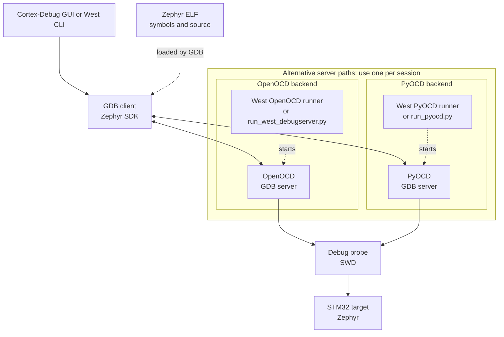

# STM32 Wireless Debugging

This repository is licensed under Apache-2.0; see [LICENSE](LICENSE). The
bundled ST SVD files retain their original copyright and SPDX notices.

## Project goals

- Provide a simple, transparent VS Code GUI for debugging Zephyr applications
  using West's runner integrations and Cortex-Debug, without a complex plugin
  stack that obscures configuration.
- Let the user select an existing build directory and start a debug session or
  attach to a target already running firmware.
- Pay particular attention to low-power standby and resume, which can affect
  debug behavior. The dedicated [`dbg_tester` application](https://github.com/asm5878/z_applications/blob/main/dbg_tester/README.rst)
  was developed to exercise this use case.
- Assume a standard Zephyr setup, as described in the [Zephyr getting started
  guide](https://docs.zephyrproject.org/latest/develop/getting_started/index.html).

## Project non-goals

- **Don't** provide a separate GUI build system; builds and configuration remain
  command-line West workflows.
- **Don't** support or test every STM32 SoC; the scope is STM32 Wireless SoCs.
- **Don't** cover non-standard Zephyr workspace or toolchain setups.

## 1. GDB, OpenOCD, and PyOCD

### 1.1 Roles in a Zephyr debug session

GDB is the debugger: it reads symbols and source information from the Zephyr
ELF, controls execution, sets breakpoints, and inspects threads, variables,
and registers. GDB does not speak directly to the board's debug probe. It
connects to a GDB server, which translates GDB remote-protocol requests into
probe and target operations over SWD.

OpenOCD and PyOCD are alternative GDB server programs; Zephyr provides runner
plugins that invoke them. West selects the runner recorded for the build or
the runner specified with `-r`; the runner starts the server, handles
target-specific operations, and connects GDB. OpenOCD is used when its
host-side support is available for the board and probe. PyOCD provides a
Python-based server for supported debug probes and target devices. They
provide the hardware-facing layer; GDB provides the interactive source-level
debugging experience.



### 1.2 Where the tools come from

This setup was tested with Zephyr SDK host tools version `1.0.1` and PyOCD
version `0.45.1`.

- **GDB and OpenOCD:** supplied as native host tools by the Zephyr SDK. OpenOCD
  is under the SDK's `hosttools/openocd` directory; its executable and scripts
  are recorded in the build's `zephyr/runners.yaml`. Inspect that file or run
  `west debug --context -d <build-dir> -r openocd` to view runner settings.
- **PyOCD:** a Python dependency installed in the Zephyr workspace virtual
  environment. The venv must be active before running PyOCD commands.
  Its executable is `.venv/Scripts/pyocd` on Windows and `.venv/bin/pyocd` on
  Linux/macOS.
  VS Code tasks use the workspace venv directly and and West's`pyocd` runner uses
  the Python package from that environment.

If PyOCD does not recognize the target, update/search the pack index and
install the matching CMSIS Device Family Pack (DFP) from the active venv.
For the STM32WBA65RI, run these commands from the Zephyr workspace root:

```sh
pyocd --version
pyocd pack find --update "STM32WBA65RI*"
pyocd pack install --update "STM32WBA65RI*"
pyocd list --targets
pyocd gdbserver --target stm32wba65rivx
```

The `--target` option selects the device PyOCD should connect to. Use the
target name shown by `pyocd list --targets` if it differs for another device.

### 1.3 GDB environment and initialization

GDB reads a file named `.gdbinit` from the user's home directory when it
starts. Create it there, not in the project or build directory. On Windows,
that is usually `C:\Users\<your-username>\.gdbinit`. Save it as a plain-text
file named exactly `.gdbinit`, not `.gdbinit.txt`.

GDB uses the `HOME` environment variable to find this file. Linux and macOS
normally define `HOME` already. In PowerShell, set it to your Windows user
directory before starting VS Code or GDB:

```powershell
$env:HOME = $env:USERPROFILE
```

Put GDB commands in the file to apply them whenever GDB starts, including
sessions launched by West or Cortex-Debug. For example, this command disables
GDB's page-by-page pause when output fills the terminal, so automated debug
sessions can continue without waiting for a key press:

```gdb
set pagination off
```

The PowerShell assignment above applies only to that PowerShell process and
programs started from it. To launch VS Code from there, use `code .`; or set
`HOME` in your Windows user environment and restart VS Code.

### 1.4 Required Zephyr changes

The West runner workflows depend on external STM32 Wireless changes to Zephyr
for reliable `west debug` and `west attach`, particularly the OpenOCD
non-reset attach path. These changes are not supplied by cloning
`z_stm32w_config`; they are proposed in the currently unmerged
[Zephyr pull request #121062](https://github.com/zephyrproject-rtos/zephyr/pull/121062).Until it is merged, retrieve the PR branch from my fork and apply its
five commits to your Zephyr checkout:

```sh
git remote add asm5878 https://github.com/asm5878/zephyr.git
git fetch asm5878 stm32wbax_stdby_debug
git cherry-pick 315e2b7496cea0c80857bbaf846d5d1aaa265f4b
git cherry-pick 643d189f83a774539b2877a73cb2e4801fb9866a
git cherry-pick 8fa50c36bf49058171e7f0d08554d37bed25b8a5
git cherry-pick f9c1368f83b25721103b33652189e2955ebd7765
git cherry-pick 739b35b93561e129b1c1dcbcee00412d6451a05a
```

Run the cherry-pick commands in order. If you already added my remote, skip
the `remote add` command.
Without these changes, the commands or board-specific reset/attach behavior will not 
work as documented.

Once the pull request will be merged in the upstream, these local cherry-picks will be 
no longer required (and this paragraph will be removed).

If you are not used to git cherry-pick command and you are not able to manage git conflicts,
please have a look at the modifications and apply them manually to your zephyr baseline. 

### 1.5 Debug build configuration

For source-level debugging with Zephyr thread information, enable these
configs in your application configuration:

```ini
CONFIG_DEBUG=y
CONFIG_DEBUG_OPTIMIZATIONS=y
CONFIG_THREAD_NAME=y
CONFIG_DEBUG_THREAD_INFO=y
```

### 1.6 West debug, attach, and GDB commands

West `debug` uses the selected runner to load the image onto the target, reset
the SoC, and start an interactive GDB session.
West `attach` connects GDB to the image already running on the target without resetting
the SoC or reflashing.

West uses the `build` directory by default. Add `-d <build-dir>`, when using a different build directory.

The default debug runner is recorded in the build's `zephyr/runners.yaml`.
Specify a runner with `-r <runner>` only when selecting one other than the build's default.

`--no-rebuild` is optional and prevents West from rebuilding or reconfiguring
before starting the runner. It does not change whether the runner loads or
resets the target.

```sh
# Launch/debug using the default build directory and runner (OpenOCD)
west debug

# Select PyOCD instead of the default OpenOCD runner
west debug -r pyocd --tool-opt=-M=under-reset

# Attach without reflashing
west attach --cmd-pre-init "set NO_RESET_ATTACH 1"
west attach -r pyocd
```

West starts GDB for the selected runner. At the GDB prompt, the most useful
commands are:

| Command | Purpose |
| --- | --- |
| `break main` or `break function_name` | Set a breakpoint. |
| `continue` (`c`) | Resume execution until the next breakpoint or stop. |
| `next` (`n`) / `step` (`s`) | Execute one source line, stepping over/into calls. |
| `finish` | Run until the current function returns. |
| `bt` | Show the current call stack. |
| `info threads` / `thread <n>` | List Zephyr threads / select one. |
| `info locals` / `print expression` | Inspect local variables / evaluate an expression. |
| `info registers` | Inspect CPU registers. |
| `monitor reset halt` | Reset and halt the target; use for launch, not when preserving an attached target's state. |
| `detach` / `quit` | Detach from the target / exit GDB. |

## 2. Zephyr GUI debugging setup

**Prerequisite:** Before using the GUI, verify that command-line `west debug`
and `west attach` both work for the selected board, build directory, and
runner. Configure the application as described in section 1.5 and apply the
Zephyr changes in section 1.4 where required. Cortex-Debug uses the same West
runner and cannot compensate for a failing CLI debug or attach setup.

### 2.1 Clone the GUI workspace

Clone this repository inside the Zephyr west workspace.

```sh
cd /path/to/zephyrproject
git clone https://github.com/asm5878/z_stm32w_config.git
```
The workspace refers to its Zephyr parent root by the name `zephyrproject`.
Keep that root name or update the `${workspaceFolder:zephyrproject}` references
if changing the workspace configuration.

Open `z_stm32w_config.code-workspace` in VS Code by double-clicking it.

### 2.2 VSCode extension and application configurations

To keep Zephyr-specific extensions and settings separate from other projects, you can create a VS Code profile named `Zephyr` and associate it with this workspace.

Install the VS Code **Cortex-Debug** extension (`marus25.cortex-debug`),
available from Extensions.

The workspace also recommends the C/C++ extension pack and Embedded Tools.

The VS Code tasks invoke the virtual-environment tools directly. 
The task paths select `.venv/Scripts` on Windows and `.venv/bin` on Linux/macOS.
GDB and the ARM compiler are resolved from `../../zephyr-sdk-1.0.1`, relative to this workspace folder. 
This matches the layout where `zephyr-sdk-1.0.1` is in the user's home directory and this
repository is nested under the Zephyr workspace

The PyOCD targets mapped by the workspace are:

| Zephyr board | PyOCD target |
| --- | --- |
| `nucleo_wba65ri` | `stm32wba65rivx` |
| `nucleo_wba55cg` | `stm32wba55cgux` |
| `nucleo_wba25ce1` | `stm32wba25ceux` |
| `nucleo_wb09ke` | `stm32wb09kevx` |

The WBA65 board has received the most extensive debug testing. Target names
identify MCU parts, not Zephyr board names. WB09 may require installing the
DFP described in section 1.2.

### 2.3 VS Code GUI: Cortex-Debug

The GUI uses the same GDB and hardware-facing OpenOCD/PyOCD mechanisms as the
command line. Cortex-Debug is the graphical front end: it starts the configured
prelaunch task, connects GDB to `localhost:3333`, and presents source stepping,
breakpoints, variables, registers, and threads in VS Code. It is not a
different debug protocol or a replacement for the runner/server.

Open **Run and Debug** (`Ctrl+Shift+D`), choose a profile, and press **F5**.
The current profiles are:

| Profile | Behavior |
| --- | --- |
| `Debug (PyOCD)` | Starts PyOCD in `under-reset` mode at 1 MHz, runs the WBA65RI PyOCD hook, connects GDB, then sends `monitor reset halt`. It does not load the ELF; the target must already run the desired firmware. |
| `Debug (OpenOCD)` | Starts West's OpenOCD debug server and sends GDB `load` to program the selected ELF. |
| `Attach (PyOCD)` | Starts PyOCD in `attach` mode and connects GDB without loading the ELF. The current WBA65RI hook calls `board.target.halt()` on connection, so the target is halted. |
| `Attach (OpenOCD)` | Starts West's OpenOCD debug server with `NO_RESET_ATTACH` and halt commands; GDB attaches without loading the ELF. |

PyOCD tasks automatically select the target from the board recorded in the
configured build's `CMakeCache.txt`, using the mapping above. The WB09 target
may require installing the DFP described in section 1.2. Both server types use
GDB port `3333`; PyOCD also uses telnet port `4444`. Run only one server at a
time. OpenOCD profiles stop the managed West/OpenOCD process tree when the
debug session ends, including **Disconnect and Suspend**. PyOCD's background
task remains active until stopped.

The `West Build`, `West Configurable Build`, and `West Flash` tasks prompt for
the build directory, defaulting to `${workspaceFolder:zephyrproject}/build`.
Each Cortex-Debug launch or attach profile also prompts for the build directory
in VS Code Quick Input before starting its debug server. The prompt defaults to
the `z_stm32w_config.buildDirectory` setting, currently `build`. The selected
directory is used to prepare the matching ELF and SVD and to start the server.

The `Prepare SVD for Cortex-Debug` task reads the board from the selected
build's `CMakeCache.txt` and selects the matching file from the repository's
`svd/` directory:

| Zephyr board | SVD file |
| --- | --- |
| `nucleo_wba65ri` | `STM32WBA65.svd` |
| `nucleo_wba55cg` | `STM32WBA55.svd` |
| `nucleo_wba25ce1` | `STM32WBA25.svd` |
| `nucleo_wb09ke` | `STM32WB09.svd` |

The selected file is copied to the ignored `.generated/selected.svd` path, and
the matching ELF is copied to `.generated/selected.elf`. The selected build
directory is saved in `.generated/selected-build-directory.txt` for the debug
server tasks. All four launch profiles use these generated files. The task
reports an error if the board is unsupported, the ELF is missing, or its SVD
file is missing. The bundled ST SVD files retain their Apache-2.0 headers; the
repository license is included in [LICENSE](LICENSE).

The launch profiles and IntelliSense compiler path use the SDK location
described above. Confirm the SDK version and repository layout match those
paths if moving the workspace.

### 2.4 Sample application to test stdby debugging

Standby behavior is covered by the `dbg_tester` application. It alternates a
30-second busy phase and a 30-second sleep/standby phase; while both threads
are blocked, Zephyr power management can enter standby. See
[`dbg_tester/README.rst`](https://github.com/asm5878/z_applications/blob/main/dbg_tester/README.rst),
[`prj.conf`](https://github.com/asm5878/z_applications/blob/main/dbg_tester/prj.conf),
and
[`stm32wba_pwr_optim.overlay`](https://github.com/asm5878/z_applications/blob/main/dbg_tester/boards/stm32wba_pwr_optim.overlay).
Set breakpoints in `busy_thread()` or `stdby_thread()` and continue through the
alternating phases. Function breakpoints can also be set on
`set_mode_suspend_to_ram_enter()` and `set_mode_suspend_to_ram_exit()` in the
STM32WBA power-management code. If the debugger reaches both functions, it is
properly tracking standby entry and resume.

### 2.5 Debug workflow summary

#### Command-line debugging

| Step | Action |
| --- | --- |
| Prepare | Apply the Zephyr changes from section 1.4 where required, build the application with the debug options in section 1.5, and confirm the selected board and runner. |
| Launch a debug session | Run `west debug` to use the default `build` directory and OpenOCD runner. Add `-r pyocd --tool-opt=-M=under-reset` to select PyOCD; the current runner uses `--no-load`, so firmware must already be programmed. Use `-d <build-dir>` for a different build directory. |
| Attach to a running target | Run `west attach --cmd-pre-init "set NO_RESET_ATTACH 1"` with the default OpenOCD runner, or `west attach -r pyocd` to select PyOCD. Use `-d <build-dir>` for a different build directory. |
| Debug | Use GDB commands such as `break`, `continue`, `next`, `bt`, and `info threads`; see section 1.6. |

#### GUI debugging

| Step | Action |
| --- | --- |
| Prepare | Verify CLI `west debug` and `west attach` work first; open `z_stm32w_config.code-workspace` and select the build directory containing the matching Zephyr ELF. |
| Start | In VS Code, open Run and Debug (`Ctrl+Shift+D`), choose a Cortex-Debug profile, and press `F5`. The profile prompts for the build directory. |
| Choose a profile | OpenOCD Debug loads the selected ELF. PyOCD Debug does not load it, so the target must already run the desired firmware. Attach profiles connect without loading the ELF. |
| End the session | OpenOCD profiles stop the managed server process tree on disconnect. The PyOCD background task remains active and must be stopped separately. |

## 3. Official documentation

- [Zephyr `west build`](https://docs.zephyrproject.org/latest/develop/west/build-flash-debug.html#building-west-build)
- [Zephyr `west flash`](https://docs.zephyrproject.org/latest/develop/west/build-flash-debug.html#flashing-west-flash)
- [Zephyr `west debug` and `west attach`](https://docs.zephyrproject.org/latest/develop/west/build-flash-debug.html#debugging-west-debug-west-debugserver)
- [Cortex-Debug extension documentation](https://github.com/Marus/cortex-debug/wiki)
- [GNU GDB manual](https://sourceware.org/gdb/current/onlinedocs/gdb.html/)
- [PyOCD documentation](https://pyocd.io/docs/)
- [OpenOCD User's Guide](https://openocd.org/doc/html/)

## 4. Credits

Thanks to [Ali Hozhabri](https://github.com/HoZHel) for sharing an initial
configuration effort, and to [Marcel Ball](https://github.com/Marus) for his
work on the Cortex-Debug extension.

## 5. TODO

1. Validate all debug workflows, including relative Zephyr SDK paths, on
  Windows, Linux, and macOS with supported probes.
2. Identify, track, and upstream the external Zephyr patches needed for
  reliable West `debug` and `attach` support across the STM32 Wireless boards.